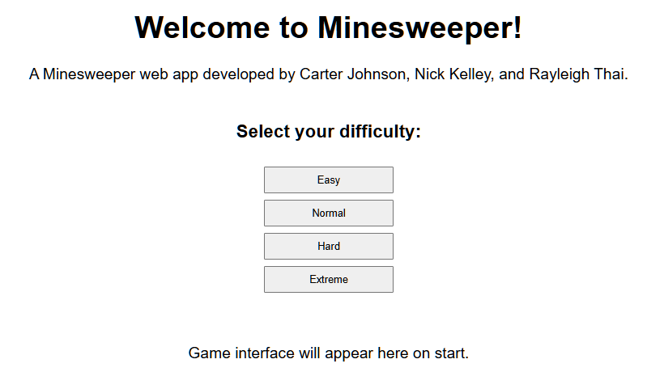
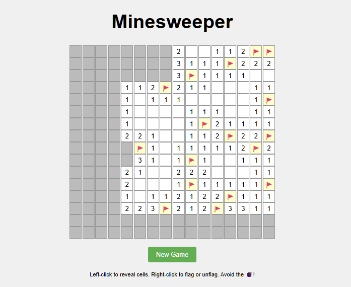

## Minesweeper Game
### By: Nick Kelley ([@nksz6](https://github.com/nksz6))

A web-based implementation of the classic Minesweeper game built with Spring Boot and Thymeleaf.

## Features

- Multiple difficulty levels:
  - Easy (8x8 board, 9 mines)
  - Normal (16x16 board, 40 mines)
  - Hard (16x30 board, 99 mines)
  - Extreme (24x30 board, 180 mines)
- Left-click to reveal cells
- Right-click to flag/unflag potential mines
- Auto-reveal of adjacent empty cells
- Game over state reveals all mines
- Win detection when all non-mine cells are revealed

## Screenshots

## Technologies Used
- Java 21
- Spring Boot
- Thymeleaf
-HTML/CSS